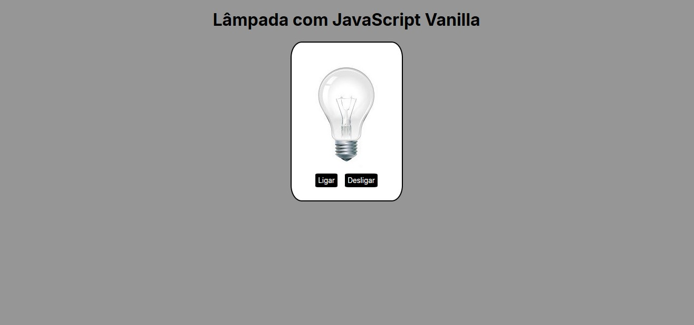
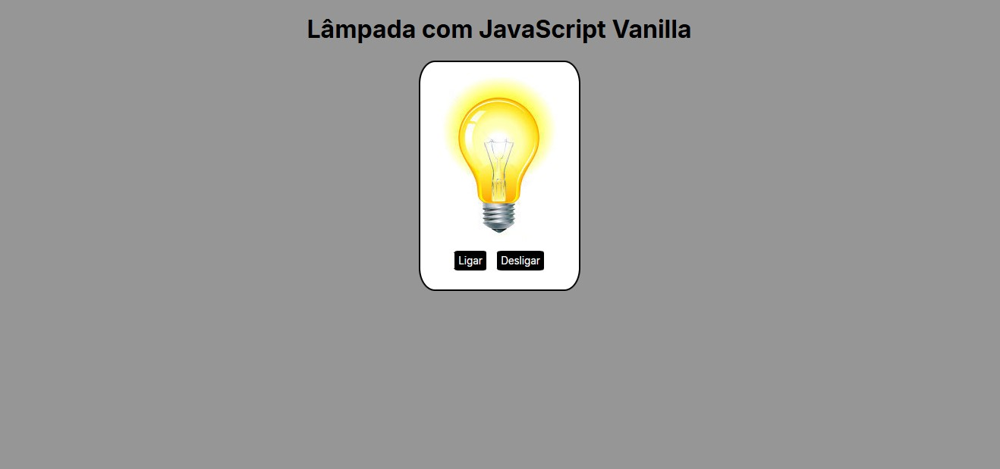
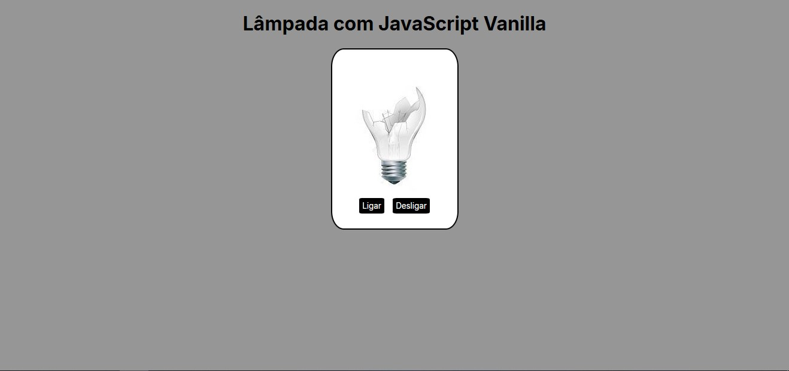

# 📌 Lampada

Página simples de acender, desligar e quebrar uma lâmpada com HTML/CSS?

---

## 🔗 Acesso ao projeto

[🔗 Clique aqui para acessar](https://luis-hans.github.io/Lampada/)

---

## 🎯 Funcionalidades

- [x] Trocar a imagem da lâmpada com JavaScript.

---

## 🖼️ Preview





---

## 🚀 Tecnologias utilizadas

- HTML.
- CSS.
- JavaScript.

---

## ⚙️ Como usar

```bash
# Clone o repositório
git clone Luis-hans/lampada

# Acesse a pasta do projeto
cd lampada

# Abra o arquivo index.html no navegador
```

---

## 📚 Aprendizados

- HTML semânico.
- JavaScript atualizado.

---

## 🧾 Licença

Este projeto está sob a licença MIT. Sinta-se à vontade para usar, modificar e compartilhar!

---

## 🤝 Contato

Feito por Luís Henrique  
📬 luishenrique.lhans@gmail.com  
🐙 [Luis-hans](https://github.com/Luis-hans)
